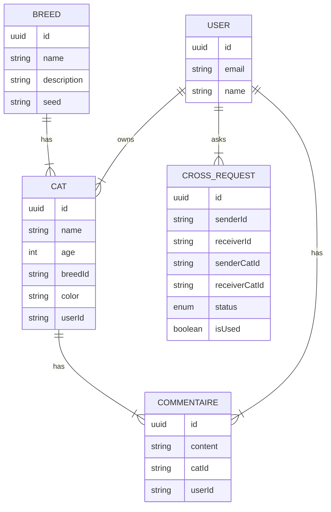

## ErDiagram

```mermaid
erDiagram
    USER {
        uuid id
        string email
        string name
    }
    CAT {
        uuid id
        string name
        int age
        string breedId
        string color
        string userId
    }
    BREED {
        uuid id
        string name
        string description
        string seed
    }
    COMMENTAIRE {
        uuid id
        string content
        string catId
        string userId
    }
    CROSS_REQUEST {
        uuid id
        string senderId
        string receiverId
        string senderCatId
        string receiverCatId
        enum status
        boolean isUsed
    }
    CAT ||--|{ COMMENTAIRE : has
    BREED ||--|{ CAT : has
    USER ||--|{ CAT : owns
    USER ||--|{ COMMENTAIRE : has
    USER ||--|{ CROSS_REQUEST : asks
```
